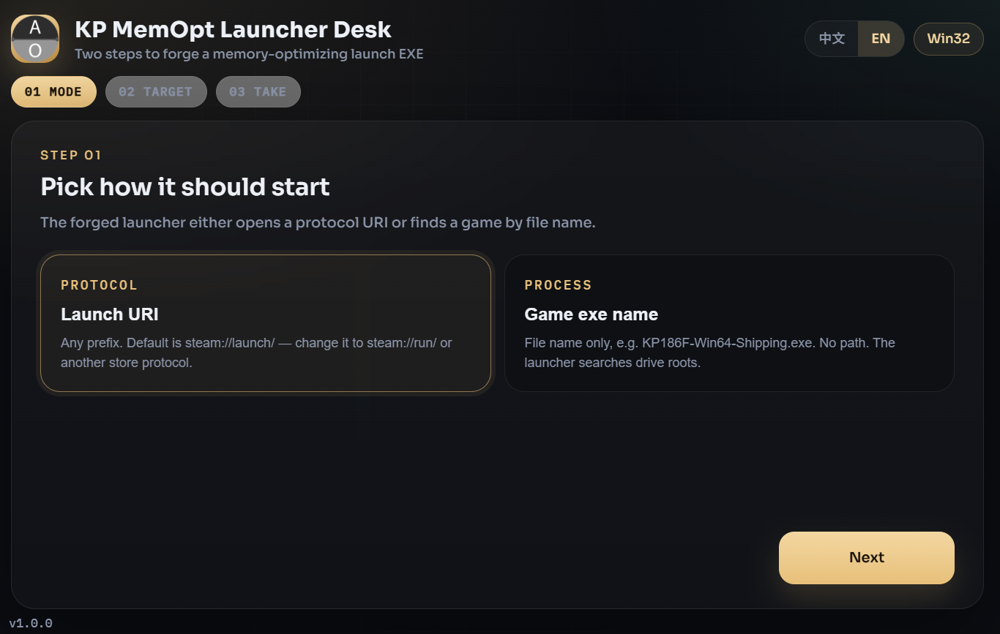

<div align="center">

# KP MemOpt Launcher Desk

**Packed via Axiox Media**

A two-step Windows desk that forges a silent memory-optimizer launcher EXE from a protocol URI or a game file name.

<p>
  <a href="docs/README-zh.md"></a>
</p>

<p>
  <a href="#install">Install</a> ·
  <a href="#features">Features</a> ·
  <a href="#requirements">Requirements</a> ·
  <a href="#architecture">Architecture</a> ·
  <a href="#documentation">FAQ</a>
</p>

<p>
  
  
  
  
</p>

</div>

<div align="center">
  
</div>

> [!NOTE]
> The desk app EXE is unsigned. SmartScreen may warn on first run. Forging a launcher needs the inbox `.NET Framework` `csc.exe` that ships with Windows.

---

## At a glance

| Item | Value |
|---|---|
| UI | Black-gold step wizard, zh / en |
| Step 1 | Protocol URI or exe file name |
| Step 2 | Type the URI / name, forge EXE |
| Forged EXE | Silent, admin, singleton, 60s resident trim |

<a id="install"></a>

## Install

### 1. GitHub Deploy Desk (recommended)

One-click deploy this repository with [GitHub Deploy Desk](https://github.com/axioxmedia/github-deployer).

1. Get the deployer: https://github.com/axioxmedia/github-deployer
2. Paste this repo URL into Deploy Desk.
3. Read the README in the app, then confirm deploy.

That is the supported install path. Use the source / EXE steps below only if you are already building from a local checkout.

### 2. Run from source or freeze an EXE

| Path | Command |
|---|---|
| Frozen desk | `dist\MemOptLauncherDesk.exe` after `build_exe.bat` |
| Source | `start.bat` or `python app.py` |

<a id="features"></a>

## Features

| Feature | Detail |
|---|---|
| Protocol mode | Any prefix. Default chip is `steam://launch/` |
| Exe-name mode | File name only — no path. Searches the launcher folder tree, then fixed drive roots |
| Memory pass | Empty working sets, flush modified list, purge standby list |
| Protect list | Game + launcher + Steam helpers + core OS processes |
| Priority | `HIGH_PRIORITY_CLASS` on the attached game process |
| Resident loop | Every 60 seconds while the game is alive; 30s relaunch grace |

<a id="requirements"></a>

## Requirements

| | Minimum | Recommended |
|---|---|---|
| OS | Windows 10 | Windows 11 |
| Python (source / freeze) | 3.11 | 3.12 |
| Compiler for forged EXE | .NET Framework 4.x `csc.exe` | same |

<a id="architecture"></a>

## Architecture

FastAPI serves `static/` on `127.0.0.1`. pywebview hosts the wizard. `POST /api/launcher/generate` fills `launcher_template.cs` and compiles it with `csc` into a windowless launcher.

```
wizard → FastAPI → C# template → csc.exe → *_MemOptLauncher.exe
```

<a id="documentation"></a>

## Documentation

<details>
<summary>What does the forged EXE do?</summary>

It requests admin, takes a singleton mutex, runs a full memory pass, starts the URI or the found exe, then every minute trims other processes and raises the game priority. It exits after the game process disappears for 30 seconds. URI mode stays resident if no game name is known.

</details>

<details>
<summary>Do I put the launcher next to the game?</summary>

No. Give the file name only. The launcher searches from its own folder downward, then walks fixed drives.

</details>

<details>
<summary>Where is the log?</summary>

`memopt_launcher_desk.log` sits next to the desk EXE.

</details>

Packed via Axiox Media · [axiox.media](https://axiox.media)
